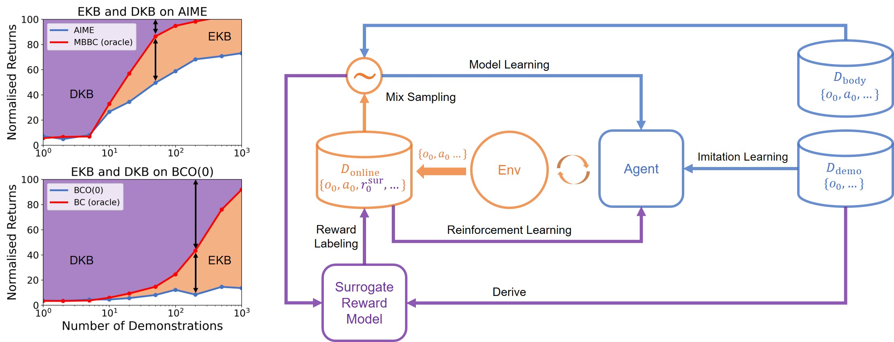

## AIME-NoB

This repository contains the original PyTorch implementation of AIME-NoB from our TMLR paper [Overcoming Knowledge Barriers: Online Imitation Learning from Visual Observation with Pretrained World Models](https://openreview.net/forum?id=BaRD2Nfj41).



If you find this code useful, please reference in your paper:

```BibTeX
@article{
zhang2025overcoming,
title={Overcoming Knowledge Barriers: Online Imitation Learning from Visual Observation with Pretrained World Models},
author={Xingyuan Zhang and Philip Becker-Ehmck and Patrick van der Smagt and Maximilian Karl},
journal={Transactions on Machine Learning Research},
issn={2835-8856},
year={2025},
url={https://openreview.net/forum?id=BaRD2Nfj41},
note={}
}
```

## Setup

### General

```
conda create -n aime-nob python=3.10
conda activate aime-nob
conda install pytorch==2.0.1 torchvision==0.15.2 torchaudio==2.0.2 pytorch-cuda=11.7 -c pytorch -c nvidia # you can also install newer version
pip install -r requirements.txt
pip install gdown --upgrade
pip install -e .
```

### Additional setup for [MetaWorld](https://github.com/Farama-Foundation/Metaworld)

```
cd ~/.mujoco
wget https://github.com/deepmind/mujoco/releases/download/2.1.0/mujoco210-linux-x86_64.tar.gz
tar -xzvf mujoco210-linux-x86_64.tar.gz
pip install git+https://github.com/IcarusWizard/Metaworld.git@reset
pip install zoopt # if you need to reset the basketball or the box-close environments
```

Then put the below two lines into your `~/.bashrc`:

```
export LD_LIBRARY_PATH=$LD_LIBRARY_PATH:~/.mujoco/mujoco210/bin
export LD_LIBRARY_PATH=$LD_LIBRARY_PATH:/usr/lib/nvidia
```

### Docker

If you prefer to use docker, we also provide a Dockerfile. You can build the image by running 

```sh
docker build .
```

## Datesets and Pretrained Models

The datasets and pretrained models can be access from [HuggingFace Datasets](https://huggingface.co/datasets/IcarusWizard/AIME-NoB) and [HuggingFace Models](https://huggingface.co/IcarusWizard/AIME-NoB). All the datasets and models are released under a [_CC BY 4.0 license_](https://creativecommons.org/licenses/by/4.0/). For more details, please check out the [Data Card](https://huggingface.co/datasets/IcarusWizard/AIME-NoB/blob/main/README.md) and [Model Card](https://huggingface.co/IcarusWizard/AIME-NoB/blob/main/README.md).

You can use our script `exp_scripts/download.py` to download and extract the files to the correct folder. Please make sure you have `wget` and `zip` installed before running the script. 

## Benchmark Results

The benchmark results from the paper are available in `results`. Feel free to use them for comparison. 

## Usage

### DMC

All 9 tasks we studied in the paper can be run similarly. I will use the task walker-run as an example here.

#### Getting the Embodiment dataset

You can easily run `python exp_scripts/download.py --name walker-plan2explore-buffer` to download and extract the files to the correct folder.

If you want to generate the embodiment dataset yourself, you need to run the plan2explore agent by

```sh
python train_scripts/train_plan2explore.py env=walker log_name=walker-run-plan2explore
```

Then you can export the dataset to `datasets/` by

```sh
mv logs/walker-run-plan2explore/train_trajectories datasets/walker-plan2explore-buffer
```

#### Getting the Demonstration dataset

You can easily run `python exp_scripts/download.py --name patchail-dmc-expert-datasets` to download and extract the files to the correct folder.

If you want to generate the embodiment dataset yourself, first download the `expert_demos.zip` from PatchAIL from [here](https://osf.io/4w69f/?view_only=e29b9dc9ea474d038d533c2245754f0c) and unzip it to `<PatchAIL_root>`.

Then you can export to our data format by 

```sh
python exp_scripts/dataset/convert_patchail_dataset.py -i <PatchAIL_root>/expert_demos/dmc/walker_run/expert_demos.pkl -o datasets/patchail-walker-run-expert
```

#### Pretraining

You need to pretrain the world model and optionally the VIPER model. You can easily run `python exp_scripts/download.py --name dmc-models` to download and extract the files to the correct folder.


Or you can choose to train the models yourself, which can be done saperately by 

```sh
python train_scripts/train_model_only.py env=walker embodiment_dataset_name=walker-plan2explore-buffer log_name=walker-model-training
```

and 

```sh
python train_scripts/train_model_only.py env=walker embodiment_dataset_name=patchail-walker-run-expert action_free=True epoch=5 log_name=walker-run-viper-training
```

Then you can further export the trained models by 

```sh
python exp_scripts/export_model_from_log.py --log_folder logs/walker-model-training --model_name walker-plan2explore-buffer
```

and 

```sh
python exp_scripts/export_model_from_log.py --log_folder logs/walker-run-viper-training --model_name walker-run-viper
```

#### Running AIME-NoB

Finally, you can run AIME-NoB by

```sh
python train_scripts/train_aime-nob-ail.py env=walker env.task=run embodiment_dataset_name=walker-plan2explore-buffer demonstration_dataset_name=patchail-walker-run-expert pretrained_model_name=walker-plan2explore-buffer
```

### MetaWorld

#### Getting the Embodiment dataset

You can easily run `python exp_scripts/download.py --name tdmpc2-metaworld-mt39` and `python exp_scripts/download.py --name tdmpc2-metaworld-mt50` to download and extract the files to the correct folder.

If you want to generate the embodiment dataset yourself, first you need to download the `mt80` dataset released by TD-MPC2 from [here](https://huggingface.co/datasets/nicklashansen/tdmpc2/tree/main/mt80) and put them in `<tdmpc2_mt80_root>`. For MetaWorld, we actually only need chunk 11, 12 and 13.

Then, you can run `python exp_scripts/dataset/convert_tdmpc2_metaworld_dataset-mt39.py --root <tdmpc2_mt80_root>` and `python exp_scripts/dataset/convert_tdmpc2_metaworld_dataset-mt50.py --root <tdmpc2_mt80_root>` to get the MW-mt39 and MW-mt50 respectively. 

#### Getting the Demonstration dataset

You can easily run `python exp_scripts/download.py --name tdmpc2-metaworld-expert-datasets` to download and extract the files to the correct folder.

To do it yourself, first, you need to download their code and models and run the evaluations. The trajectories will be stored at its log folder `<tdmpc2-logs>`. 

Then you can convert their datasets by

```sh
python exp_scripts/dataset/convert_tdmpc2_metaworld_expert_dataset.py --root <tdmpc2-logs>
```

#### Pretraining

You need to pretrain the world model and optionally the VIPER model. You can easily run `python exp_scripts/download.py --name metaworld-models` to download and extract the files to the correct folder.

Or you can choose to train the models yourself, which can be done saperately by 

```sh
python train_scripts/train_model_only.py env=metaworld embodiment_dataset_name=tdmpc2-metaworld-mt50 world_model=rssmo-m batch_size=16 horizon=64 log_name=metaworld-mt50-training
```

and 

```sh
python train_scripts/train_model_only.py env=walker embodiment_dataset_name=tdmpc2-metaworld-<task>-expert action_free=True epoch=10 log_name=metaworld-<task>-viper-training
```

Then you can further export the trained models by 

```sh
python exp_scripts/export_model_from_log.py --log_folder logs/metaworld-mt50-training --model_name tdmpc2-metaworld-mt50
```

and 

```sh
python exp_scripts/export_model_from_log.py --log_folder logs/metaworld-<task>-viper-training --model_name tdmpc2-metaworld-<task>-viper
```

#### Running AIME-NoB

Finally, you can run AIME-NoB by

```sh
python train_scripts/train_aime-nob-ail.py env=metaworld env.task=<task> embodiment_dataset_name=tdmpc2-metaworld-mt50 demonstration_dataset_name=tdmpc2-metaworld-<task>-expert pretrained_model_name=tdmpc2-metaworld-mt50 world_model=rssmo-m batch_size=16 horizon=64 batch_per_epoch=20
```